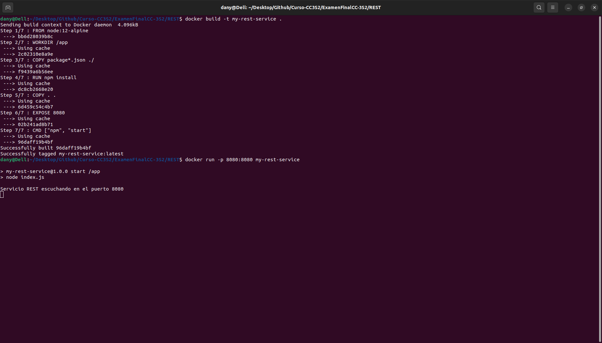
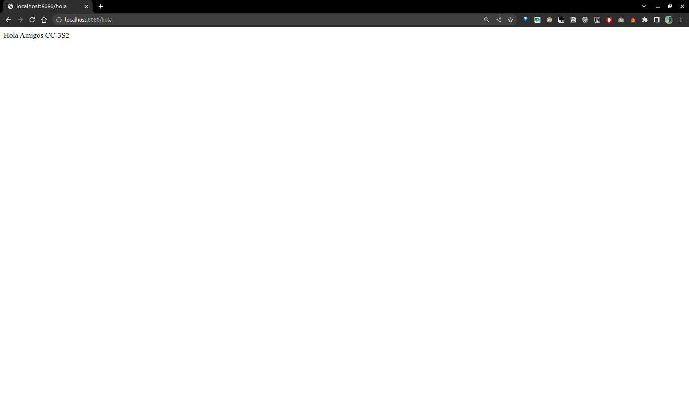
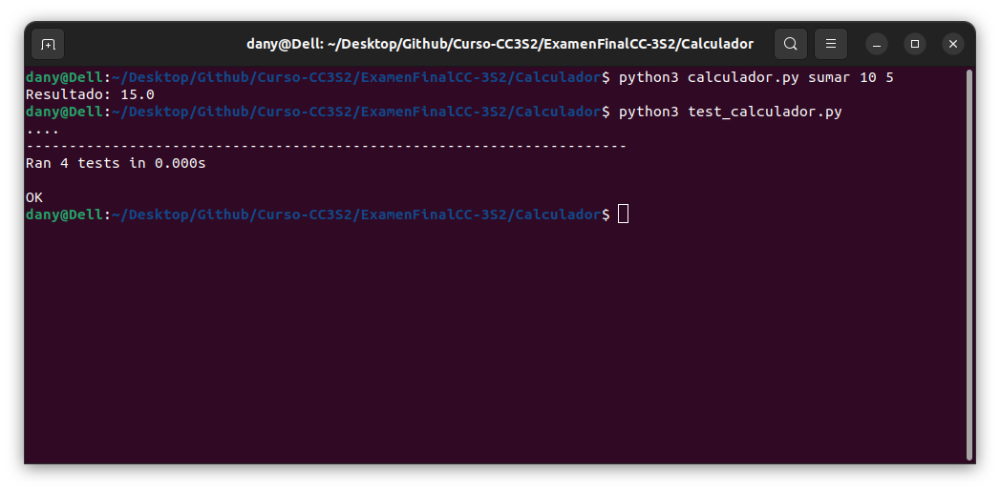
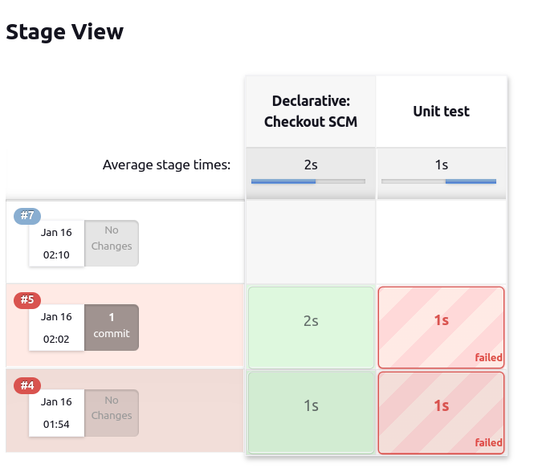

# Examen Final CC3S2

## 1. (1 punto)¿Cómo pueden los clientes encontrar microservicios y sus instancias?
A las instancias de microservicios normalmente se les asignan direcciones IP dinámicas cuando
se inician, por ejemplo, cuando se ejecutan en contenedores. Esto dificulta que un cliente realice
una solicitud a un microservicio que, por ejemplo, expone una API REST a través de HTTP.
Considera el siguiente diagrama:

<p align="center">

</p>

Los clientes pueden encontrar los microservicios y las instancias de las siguientes maneras :

- Mediante servicios de registro , con nombres de registros. Los cuales para que un cliente pueda encontrar dicho microservicio , lo hace mediante el servicio de registro. Parte de esto omite la asignación de IP dinamica que se le puede asignar al iniciar.

- A travez de DNS dinámicos , a los cuales los clientes acceden a ellos mediante el DNS dinámico que se actualiza y se asocia de manera automática con su la IP dinámica. 

- Otra manera de acceder es por los balanceadores de carga , en los cuales los clientes se conectan a un balanceador el cual distribuye las solicitudes entre las instancias de los microservicios , independientemente de las direcciones IP dinamicas que se les puede asignar. 

## 2. (2 puntos) En un entorno de sistema de microservicios, en muchos casos es deseable exponer algunos de los microservicios al exterior del entorno del sistema y ocultar los microservicios restantes del acceso externo. Los microservicios expuestos deben estar protegidos contra solicitudes de clientes malintencionados.

La protección de los microservicios expuestos al exterior , se pueden proteger añadiendo un servidor perimetral, el cúal funcionaria como un servidor proxy inverso o mediante tecnicas de seguridad como :

- Control de acceso : Se utiliza mecanismos de control de acceso basado en roles los cuales garantizan que solos los clientes con permisos asignados para el acceso a recursos especificos puedan hacer uso de estos.
- Autenticación de doble factor : Se puede utlizar mecanismos de doble autenticación con el objetivo de garantizar que los clientes autorizados puedan accede a los microservicios expuestos.
- Protección contra ataques DDOS : Frente a los attaques de denegación de servicios distribuidos (DDOS)  tiene que existir medidads de protección para que los servicios sigan en funcionamiento.
- Injección SQL : Se tienen que tener medidas de protección contra la inyección SQL , para garantizar que los microservicios expuestos no puedan verse comprometidos.
- Monitoreo continuo de la red: Monitorear continuamente el tráfico de red y los registros de acceso para detectar y responder  raudamente frente a sospechaz de actividad maliciosa.


## 3. (2 puntos) Tradicionalmente, como desarrolladores de Java, estamos acostumbrados a implementar la comunicación sincrónica mediante el bloqueo de E/S, por ejemplo, una API RESTful JSON sobre HTTP. El uso de una E/S de bloqueo significa que se asigna un subproceso desde el sistema operativo durante la duración de la solicitud. Si aumentas la cantidad de solicitudes simultáneas, un servidor podría quedarse sin subprocesos disponibles en el sistema operativo, lo que provocaría problemas que van desde tiempos de respuesta más prolongados hasta fallas en los servidores. El uso de una arquitectura de microservicios suele empeorar aún más este problema, donde normalmente se utiliza una cadena de microservicios cooperativos para atender una solicitud. Cuantos más microservicios participen en la atención de una solicitud, más rápido se agotarán los subprocesos disponibles.


> Existen dos manera de solucionar esto , una de ellas es continuar con la comunicación sincrónica 
con el bloqueo de E/S , pero en lugar de asignar un subproceso por solicitud, se asigna un subproceso por cliente. Esto permite que el cliente envíe varias solicitudes sin esperar a que se procesen las solicitudes anteriores.

> Otra solución es utilizar la comunicación asincrónica , en la cual se envían mensajes sin esperar a que el receptor los procese. Esto permite que el cliente envíe una solicitud y continúe con otras tareas mientras espera la respuesta. El receptor del mensaje puede procesar la solicitud en un subproceso separado, lo que permite que el cliente envíe más solicitudes sin esperar a que se procesen las solicitudes anteriores.

## 4. (2 puntos) Tradicionalmente, una aplicación se implementa junto con su configuración, por ejemplo, un conjunto de variables de entorno y/o archivos que contienen información de configuración. Ante un panorama de sistemas basado en una arquitectura de microservicios, es decir, con una gran cantidad de instancias de microservicios desplegadas, surgen algunas dudas:

- ¿Cómo obtengo una imagen completa de la configuración que existe para todas las instancias de microservicio en ejecución?

Se debe agregar un componente nuevo y un servidor de configuración para almacenar la configuración de todos los microservicios.

- ¿Cómo actualizar la configuración y me aseguro de que todas las instancias de microservicio afectadas se actualicen correctamente?

> Se debe realizar los cambios en la configuración y probar que todo funciona de manera correcta en un entorno de pruebas. Luego se implementa los cambios en una sola instancia del microservicio para comprobar que no hay ningún problema. Una vez comprobado esto, se debe implementar los cambios en todas las instancias del microservicio afectado, utilizando un mecanismo de despliegue automatizado, que permita realizar el cambio de manera controlada, evitando interrupciones en el servicio y permitiendo la monitorización del proceso. Finalmente se debe realizar un seguimiento continuo para asegurarse de que todo sigue funcionando correctamente.


## 5. (3 puntos) Tradicionalmente, una aplicación escribe eventos logs en archivos logs que se almacenan en el sistema de archivos local del servidor en el que se ejecuta la aplicación. Dado un panorama de sistema basado en una arquitectura de microservicios, es decir, con una gran cantidad de instancias de microservicios implementadas en una gran cantidad de servidores más pequeños, podemos hacernos las siguientes preguntas:
- ¿Cómo se obtiene una descripción general de lo que sucede en el entorno del sistema cuando cada instancia de microservicio escribe en su propio archivo log local?

> Agregando un componente que administre el registro centralizado

- ¿Cómo averiguo si alguna de las instancias de microservicio tiene problemas y comienza a escribir mensajes de error en sus archivos logs?

> Una vez agregado el componente que administre el registro centralizado ,este se debe configurar para que se envíen notificaciones de error a un canal de comunicación y detecte nuevas instancias de microservicio para recopilar sus registros.

- Si los usuarios finales comienzan a informar problemas,¿cómo puedo encontrar mensajes logs relacionados? es decir,¿cómo puedo identificar qué instancia de microservicio es la causa raíz del problema? El siguiente diagrama ilustra el problema:

<p align="center">

</p>

> Se pueden encontrar los mensajes logs relacionados mediante un API y herramientas de búsqueda para consultar los registros de todas las instancias de microservicio.

## 6. (3 puntos) Debe ser posible rastrear solicitudes y mensajes que fluyen entre microservicios mientras se procesa una solicitud externa al entorno del sistema. Algunos ejemplos de escenarios de falla son los siguientes:
- Si los usuarios finales comienzan a presentar casos de soporte con respecto a una falla específica,¿cómo podemos identificar el microservicio que causó el problema, es decir, la causa raíz?

> Las solicitudes y mensajes relacionados con la falla deben estar etiquetados con un identificador único, por ejemplo, un número de pedido. Esto permite que los mensajes de registro de todos los microservicios involucrados en el procesamiento de la solicitud se agrupen en un solo registro. Y así poder identificar el microservicio que causó el problema.

- Si un caso de soporte menciona problemas relacionados con una entidad específica, por ejemplo, un número de pedido específico,¿cómo podemos encontrar mensajes de registro relacionados con el procesamiento de este pedido específico, por ejemplo, mensajes logs de todos los microservicios que estuvieron involucrados en su procesamiento?

> Con un identificador de correlación único, se puede encontrar mensajes de registro relacionados con el procesamiento de un pedido específico. Esto permite identificar los microservicios que estuvieron involucrados en su procesamiento.

- Si los usuarios finales comienzan a presentar casos de soporte relacionados con un tiempo de respuesta inaceptablemente largo,¿cómo podemos identificar qué microservicio en una cadena de llamadas está causando la demora?

El siguiente diagrama representa esto:

<p align="center">

</p>

> Para identificar el microservicio que está causando la demora, se debe agregar un identificador de correlación único a cada mensaje y registrar el tiempo de respuesta de cada microservicio. Esto permite identificar el microservicio que está causando la demora.


# Responde e implementa cada una de las siguientes preguntas relacionadas a las actividades desarrolladas en clase. (para puntuar debes responder todas las preguntas).

## 1.(0.5 puntos ) Ejecuta CouchDB como un contenedor de Docker y publica su puerto, de la siguiente manera:
- Ejecuta el contenedor.
- Publica el puerto de CouchDB.
- Abre el navegador y verifica que CouchDB esté disponible

> Puerto 5984

<p align="center">

</p>

> Acceso mediante http://localhost:5984/_utils/

<p align="center">

</p>

## 2.(1 punto) Crea una imagen de Docker con un servicio REST, respondiendo Hola Amigos CC-3S2 a localhost:8080/hola. Utiliza el lenguaje y el framework que prefieras. Estos son los pasos que debe seguir:
- Crea una aplicación de servicio web.
- Crea un Dockerfile para instalar dependencias y librerías.
- Construye la imagen.
- Ejecuta el contenedor que publica el puerto.
- Verifica que se esté ejecutando correctamente utilizando el navegador (o curl).

> Creamos el Dockerfile el cual contiene las siguientes instrucciones:

```
# Utilizamos una imagen base de Node.js
FROM node:12-alpine

# Establecemos el directorio de trabajo en /app
WORKDIR /app

# Copiamos los archivos necesarios para la aplicación
COPY package*.json ./

# Instalamos las dependencias
RUN npm install

# Copiamos el resto de los archivos de la aplicación
COPY . .

# Exponemos el puerto 8080
EXPOSE 8080

# Iniciamos la aplicación
CMD ["npm", "start"]

```

Luego creamos el archivo index.js el cual contiene el siguiente código:

```
const express = require('express')
const app = express()
const port = 8080

app.get('/hola', (req, res) => {
  res.send('Hola Amigos CC-3S2')
})

app.listen(port, () => {
  console.log(`Servicio REST escuchando en el puerto ${port}`)
})
```
Una vez creado el Dockerfile y el código, se puede construir la imagen ejecutando el siguiente comando en la línea de comandos:

```
docker build -t my-rest-service .
```

Una vez construida la imagen, se puede ejecutar el contenedor con el siguiente comando:

```
docker run -p 8080:8080 my-rest-service
```

<p align="center">

</p>

> Acceso mediante http://localhost:8080/hola

<p align="center">

</p>

> Ahora respondera "Hola Amigos CC-3S2" cuando se acceda a la ruta localhost:8080/hola


## 3.(1 punto) Crea un master de Jenkins y imágenes de agentes Docker y úsalos para ejecutar una infraestructura de Jenkins capaz de crear proyectos de Ruby:
- Crea el Dockerfile del master de Jenkins, que instala automáticamente el complemento
de Docker.
- Crea la imagen master y ejecuta la instancia de Jenkins.
- Crea el Dockerfile del agente (adecuado para el aprovisionamiento dinámico del
agente), que instala el intérprete de Ruby.
- Crea la imagen del agente.
- Cambia la configuración en la instancia de Jenkins para usar la imagen del agente.


> Creamos el archivo Dockerfile el cual contiene las siguientes instrucciones:

```
FROM jenkins/jenkins:lts
FROM ruby:2.7

USER root

RUN apt-get update && \
    apt-get install -y docker.io

RUN usermod -a -G docker jenkins

USER jenkins

RUN /usr/local/bin/install-plugins.sh docker-plugin

RUN gem install bundler
RUN gem install rake
RUN gem install rspec
```

> Este Dockerfile utiliza la imagen oficial de Jenkins LTS como base. Luego, utiliza la instrucción `RUN` para actualizar el sistema operativo y instalar Docker, y luego agrega el usuario jenkins al grupo de docker para permitirle ejecutar comandos de docker. Finalmente, utiliza el comando `RUN` `/usr/local/bin/install-plugins.sh` para instalar el complemento de Docker en Jenkins. Luego, utiliza la instrucción `RUN` para instalar bundler, rake y rspec en el contenedor.

> Ahora construimos la imagen del master de Jenkins

```
docker build -t jenkins-ruby-docker .
```


> Luego ejecutamos el contenedor

```
docker run -p 8080:8080 -p 50000:50000 jenkins-docker
```

<p align="center">

</p>


## 4.(1 punto) Crea un pipeline que ejecuta un script de Ruby que imprima Hola Mundo desde Ruby:
- Crea un nuevo pipeline.
- Utiliza el siguiente comando de shell para crear el script hola.rb sobre la marcha:

```
sh "echo \"puts 'Hola Mundo en Ruby'\" > hola.rb"
```

- Agregue el comando para ejecutar hola.rb , utilizando el intérprete de Ruby.5.
- Ejecuta la construcción y observa la salida de la consola.


## 5.(1 punto) Crea un programa de Python que multiplique, sume, reste, divida dos números pasados como parámetros de línea de comandos. Agrega pruebas unitarias y publica el proyecto en GitHub:
- Crea dos archivos:calculador.py y test_calculador.py.
- Puedes usar la biblioteca unittest en https://docs.python.org/3/library/unittest.html.
- Ejecuta el programa y la prueba unitaria.

> La carpeta de calculador.py y test_calculador.py se encuentra en [Calculador](https://github.com/danyelliot/Curso-CC3S2/tree/main/ExamenFinalCC-3S2/Calculador)

> El archivo calculador.py contiene el siguiente código:

```
import sys

def sumar(a, b):
    return a + b

def restar(a, b):
    return a - b

def multiplicar(a, b):
    return a * b

def dividir(a, b):
    return a / b

if __name__ == '__main__':
    if len(sys.argv) != 4:
        print("Uso: calculador.py <operación> <número1> <número2>")
        sys.exit(1)

    operacion = sys.argv[1]
    a = float(sys.argv[2])
    b = float(sys.argv[3])

    if operacion == 'sumar':
        resultado = sumar(a, b)
    elif operacion == 'restar':
        resultado = restar(a, b)
    elif operacion == 'multiplicar':
        resultado = multiplicar(a, b)
    elif operacion == 'dividir':
        resultado = dividir(a, b)
    else:
        print("Operación no válida")
        sys.exit(1)

    print("Resultado:", resultado)

```

> El archivo test_calculador.py contiene el siguiente código:

```
import unittest
from calculador import sumar, restar, multiplicar, dividir

class TestCalculador(unittest.TestCase):
    def test_sumar(self):
        resultado = sumar(10, 5)
        self.assertEqual(resultado, 15)

    def test_restar(self):
        resultado = restar(10, 5)
        self.assertEqual(resultado, 5)

    def test_multiplicar(self):
        resultado = multiplicar(10, 5)
        self.assertEqual(resultado, 50)

    def test_dividir(self):
        resultado = dividir(10, 5)
        self.assertEqual(resultado, 2)

if __name__ == '__main__':
    unittest.main()

```

> Para ejecutar el programa de python se debe ejecutar el siguiente comando:

```    
python3 calculador.py <operación> <número1> <número2>
```

> Como por ejemplo:

```
python3 calculador.py sumar 10 5
```

> Para ejecutar las pruebas unitarias se debe ejecutar el siguiente comando:

```
python3 test_calculador.py
```

<p align="center">

</p>


## 6.(1 punto) Crea el pipeline de integración continua para el proyecto de calculadora de Python:
- Usa Jenkinsfile para especificar el pipeline.
- Configura el trigger para que el pipeline se ejecute automáticamente en caso de que se
haga commit en el repositorio.
- El pipeline no necesita el paso Compile ya que Python es un lenguaje interpretable.
- Ejecuta el pipeline y observa los resultados.
- Intenta hacer commit el código que rompe la construcción del pipeline y observa cómo
se visualiza en Jenkins.

Se utilizo un Jenkinsfile para la creación del pipeline de integración continua para el proyecto de calculadora de Python, el cual se encuentra en [Jenkinsfile](https://github.com/danyelliot/CalculadorFinal)


Al momento de ejecutar el pipeline no habia un agente Python instalado en el servidor de Jenkins, por lo que se creo una imagen de docker con python3 preinstalado para la ejecución del pipeline de integración continua. [Dockerfile](https://github.com/danyelliot/CalculadorFinal)

<p align="center">

</p>

Al momento de ejecutar el pipeline se observa que se ejecutan las pruebas unitarias y se ejecuta el programa de python.


## 7.(0.5 puntos) Ejecuta una aplicación Hola Amigos CC-3S2 en el clúster de Kubernetes:
- La aplicación Hola Amigos CC-3S2 puede verse exactamente igualmente al ejercicio 2
- Implementa la aplicación con tres réplicas.
- Exponga la aplicación con el servicio NodePort.
- Realiza una solicitud (usando curl ) a la aplicación.

Se crea el archivo de configuración de Kubernetes en formato YAML para la aplicación "Hola Amigos".

```
apiVersion: apps/v1
kind: Deployment
metadata:
  name: hola-amigos-cc3s2
spec:
  replicas: 1
  selector:
    matchLabels:
      app: hola-amigos-cc3s2
  template:
    metadata:
      labels:
        app: hola-amigos-cc3s2
    spec:
      containers:
      - name: hola-amigos-cc3s2
        image: <your-image-name>
        ports:
        - containerPort: 8080
        env:
        - name: PORT
          value: "8080"

---
apiVersion: v1
kind: Service
metadata:
  name: hola-amigos-cc3s2
spec:
  selector:
    app: hola-amigos-cc3s2
  ports:
  - name: http
    port: 8080
    targetPort: 8080
  type: ClusterIP

```

> Se crea el recurso en el clúster de Kubernetes

```
kubectl create -f hola-amigos-cc3s2.yaml

```

> Se verifica que el recurso se haya creado correctamente

```
kubectl get all

```


## 8.(1 punto) Implementa una nueva función, Nos vemos!, e implementa mediante una actualización continua 1:
- Esta característica se puede agregar como un nuevo punto final, /bye , que siempre
devuelve Nos vemos!.
- Reconstruye una imagen de Docker con una nueva etiqueta de versión.
- Usa la estrategia RollingUpdate y readinessProbe
- Observa el procedimiento de actualización continua.
- Realiza una solicitud (usando curl) a la aplicación.