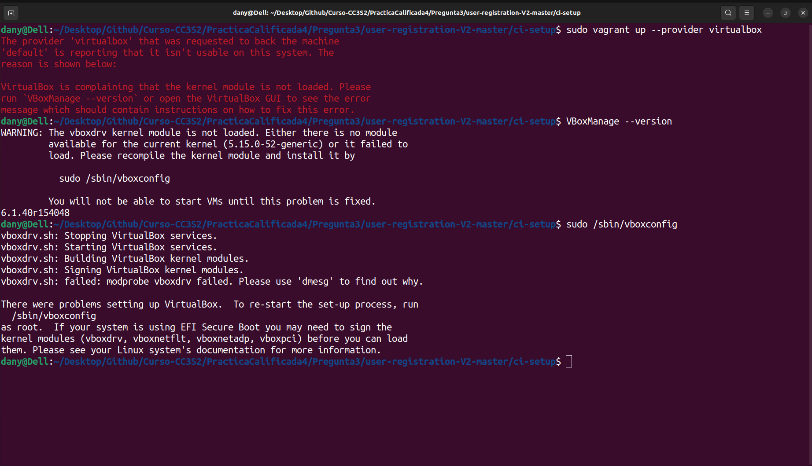

# Pregunta 3

## Descarga y compilación del proyecto

## Corriendo los contenedores

### Construcción de imagenes

### Imagenes docker

### Inicializando los contenedores

### Contenedores corriendo

## Servidor de integración continua para el proyecto

### *(Adicional)* Ejecución exitosa de la aplicacion (Java & Springboot)

## Vagrant

Se especificó el proveedor para vagrant (Oracle Virtual Box)
 
Se configuró el playground para la integración continua (CI) con Jenkins, Artifactory and SonarQube , mediante :
 
### Error en Maquina virtual en Windows 11

'''
vagrant up
'''

Debido al error se probó ejecutando en una máquina con Ubuntu 22.04 , volviendo a realizar los pasos anteriores.
Se realizó el vagrant up con el proveedor virtualbox. Sin embargo los errores que se obtienen es la compatibilidad del
Kernel con la ejecución de virtualbox , ya que el proyecto se ejecutó en una versión de Ubuntu 18.04 con una versión
menor de kernel , con la que se tiene la partición

> 5.15.0-52-generic

Se adjunta los errores mencionados por la compatibilidad de la máquina virtual que funcionará con *Vagrant* y el kernel.
 

### Documentacion de referencia de los errores

[kernel compatibility error](https://forums.virtualbox.org/viewtopic.php?f=7&t=101325)

[vagrant](https://stackoverflow.com/questions/39452720/vagrant-the-box-youre-attempting-to-add-doesnt-support-the-provider-you-reque)

[virtualbox - kernel](https://askubuntu.com/questions/958110/failed-to-start-lsb-virtualbox-linux-kernel-module)