# Actividad 21

Toda la actividad se encuentra en el repositorio [calculador](https://github.com/danyelliot/calculador)

Se realizo la actividad en una VM con Ubuntu 18.04.6 

## Ampliación de la pipeline Hello World 


Se modificó la linea 29 
```
 post { always { echo 'Hola muchas gracias' } }
````


## Creación de una etapa checkout

### Pipeline

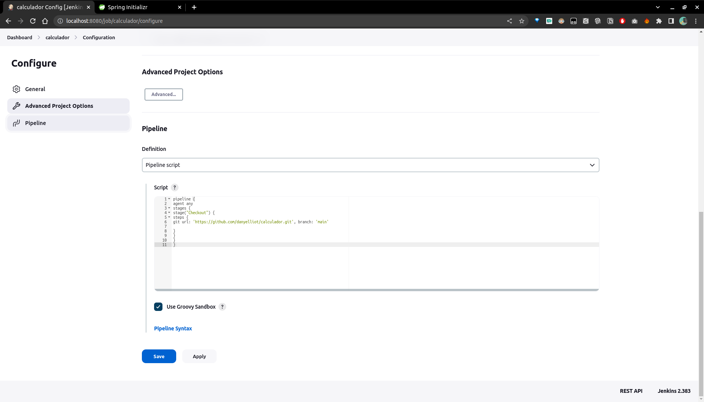

### Ejecución

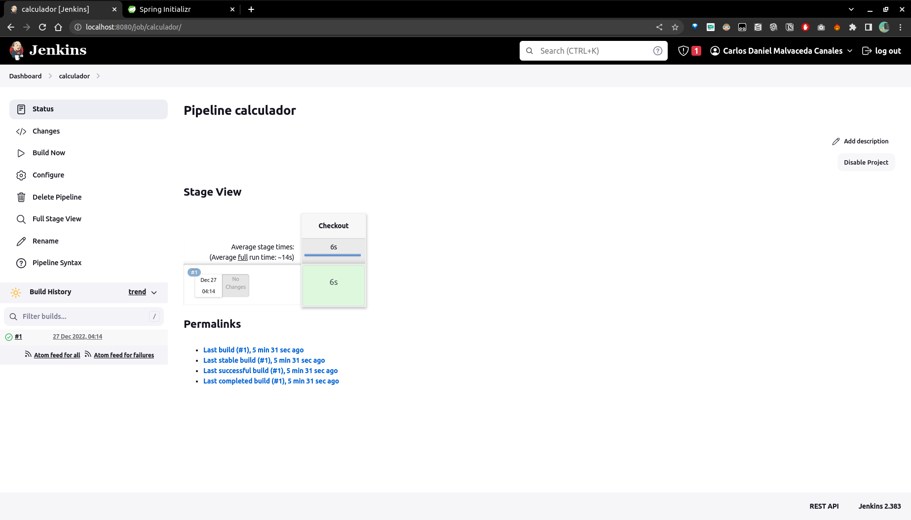


## Creación de un proyecto Java Spring Boot

### Configuración

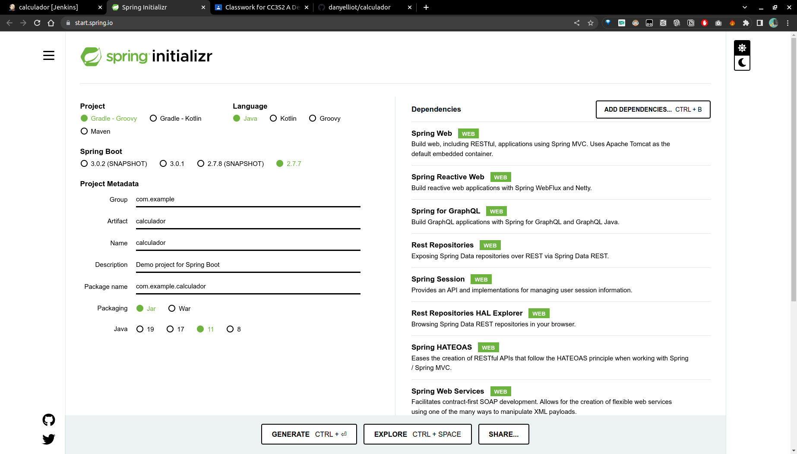


## Ejecución del proyecto

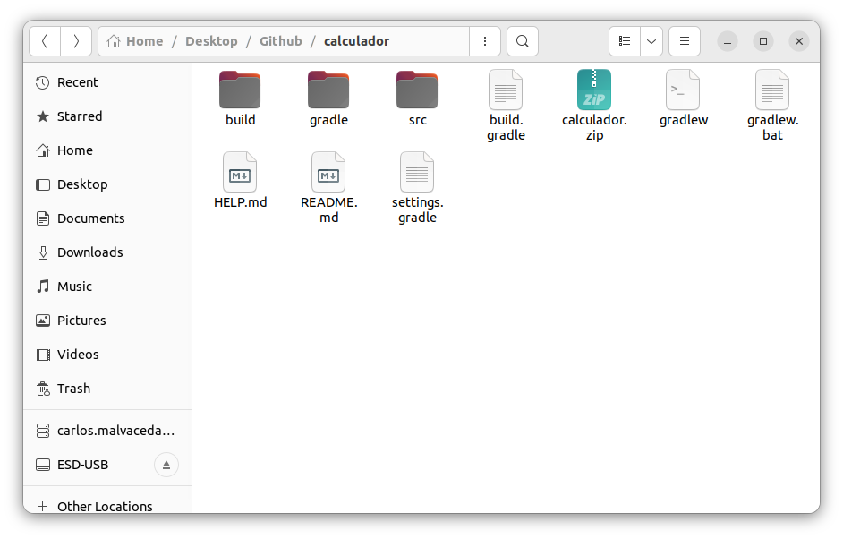

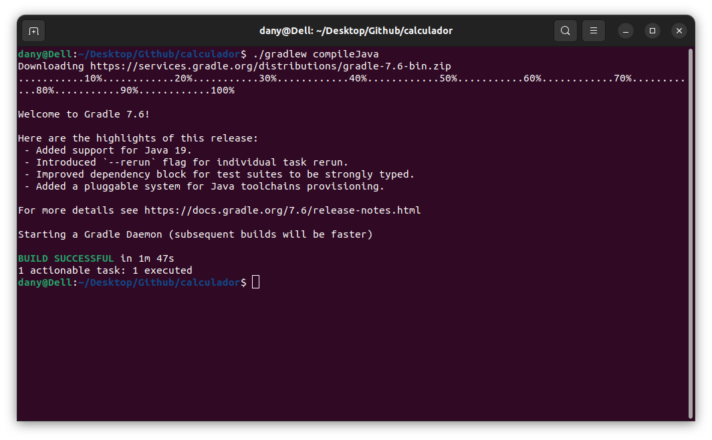

## Creación de una etapa Compile

### Agregando una etapa Compile al pipeline
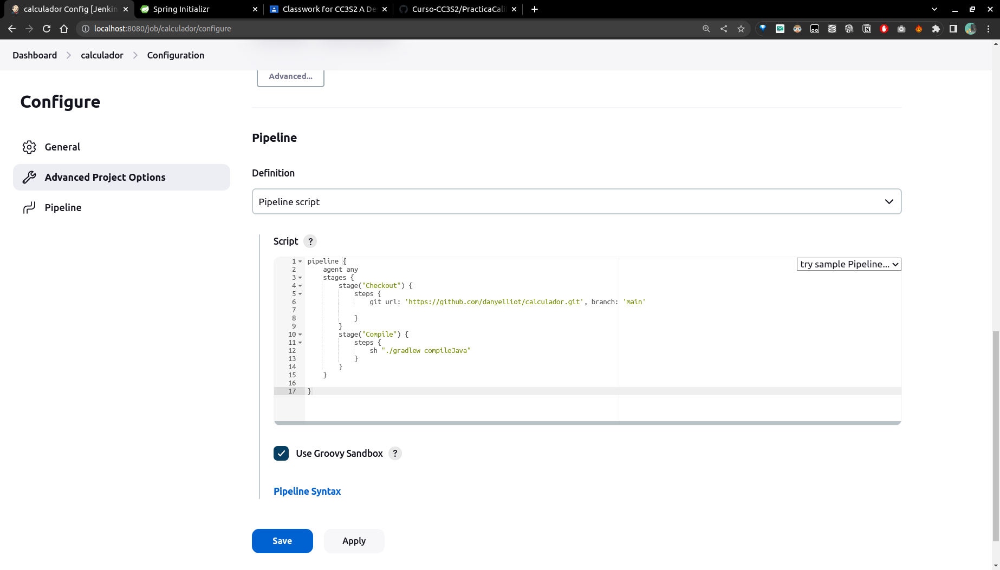

### Ejecución 

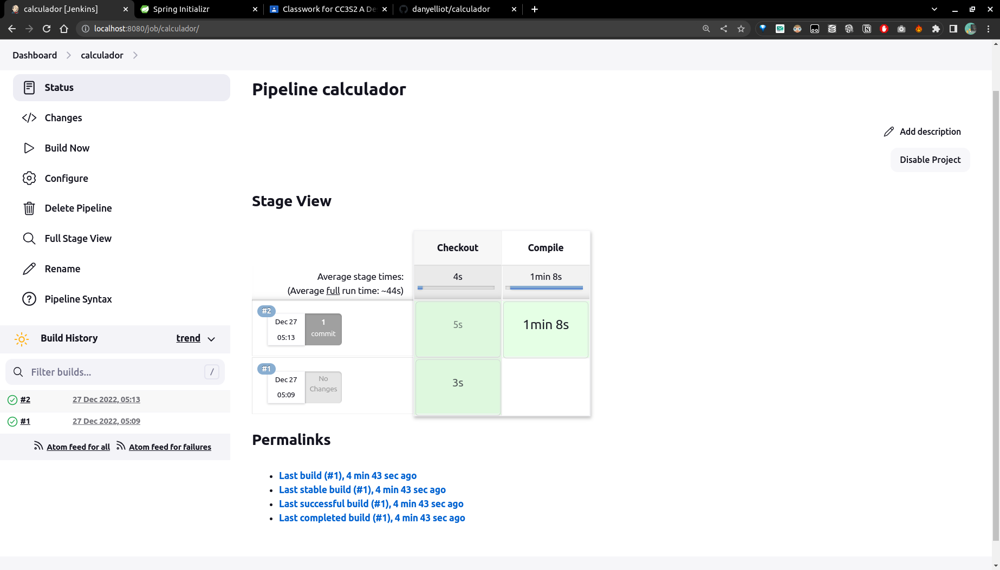

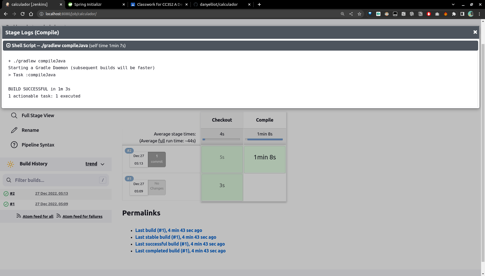

## Crear la lógica de negocios

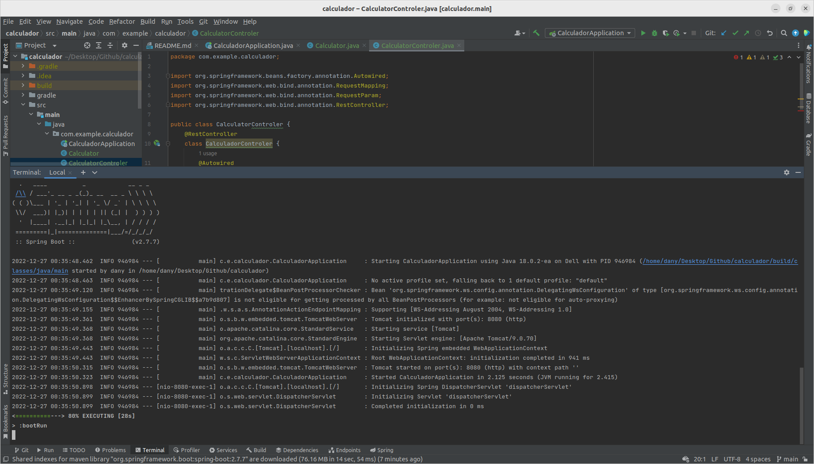

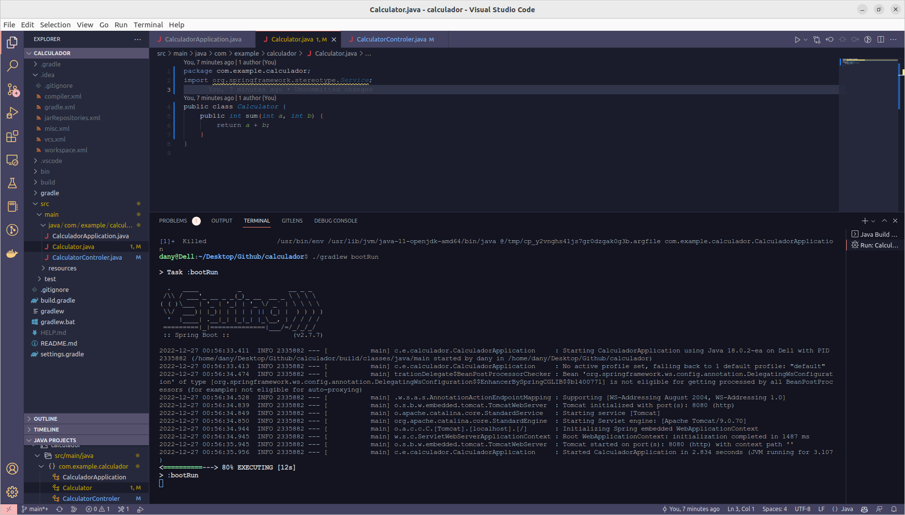

## Ejecución de la construcción en jenkins

Agregando la siguiente etapa al pipeline :

```
stage("Compile") {
    steps {
        sh "./gradlew compileJava"
    }
}
```

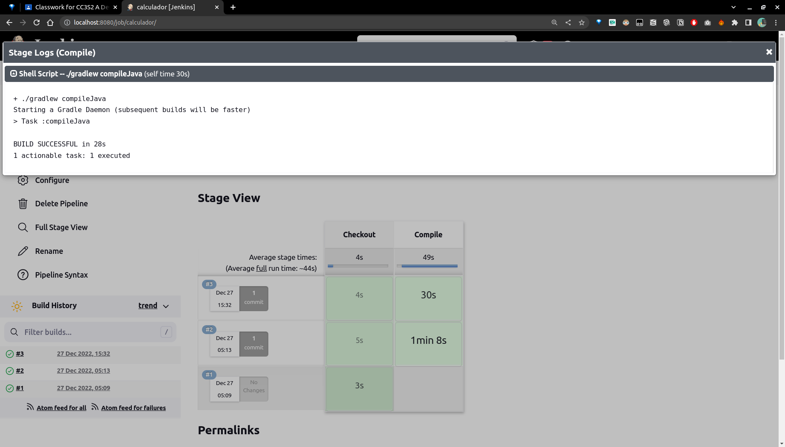


## Escribiendo una prueba unitaria

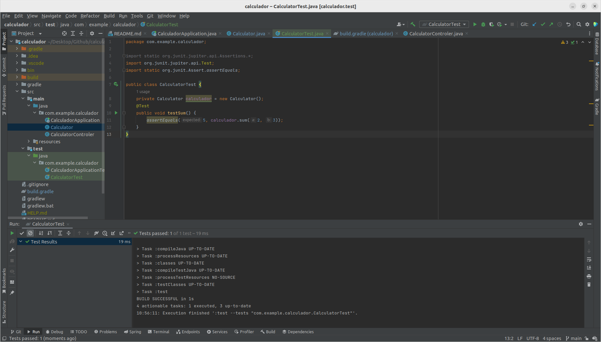

Ejecución mediante 
```
./gradlew test
```

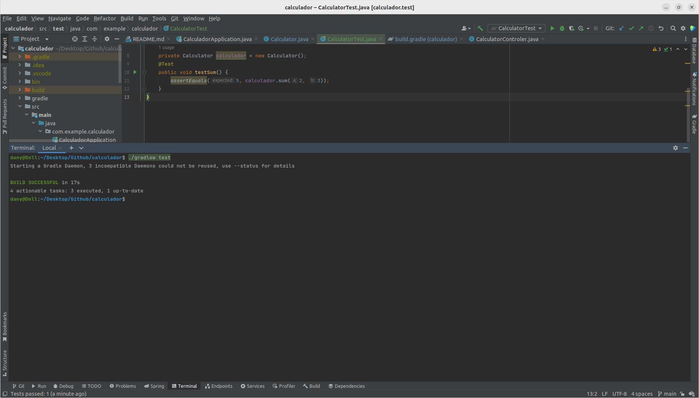

## Creación de una etapa de prueba unitaria

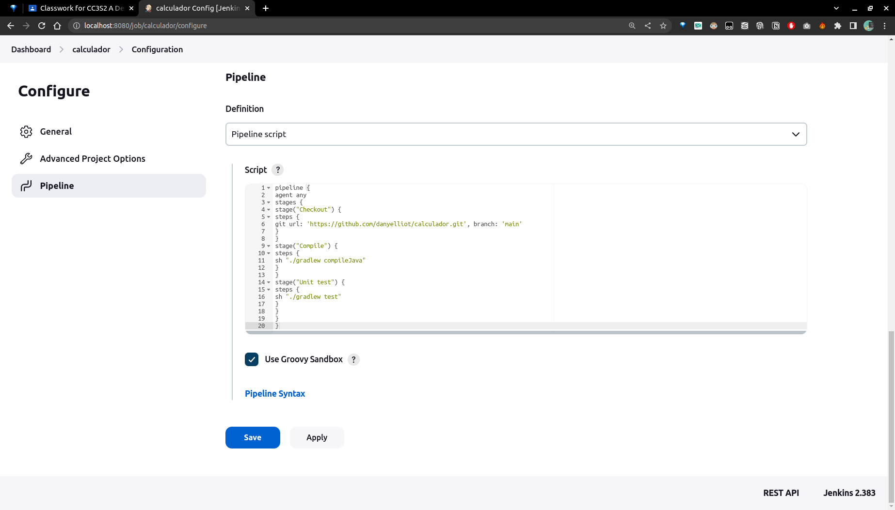

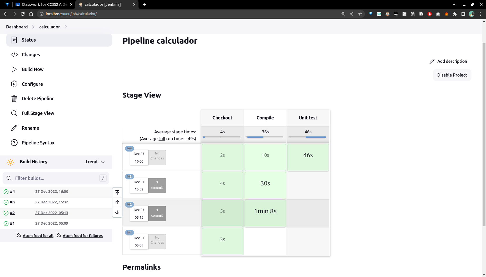

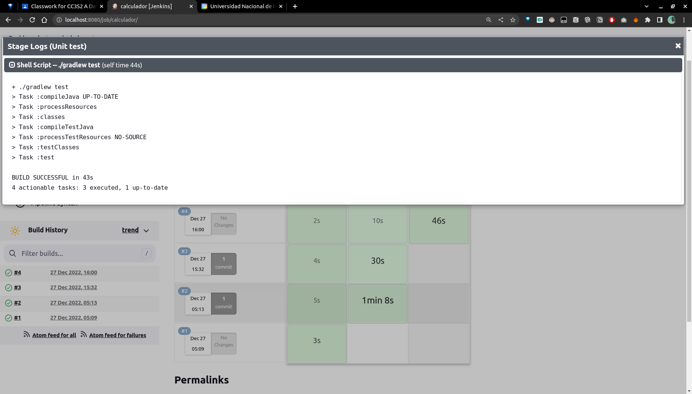


