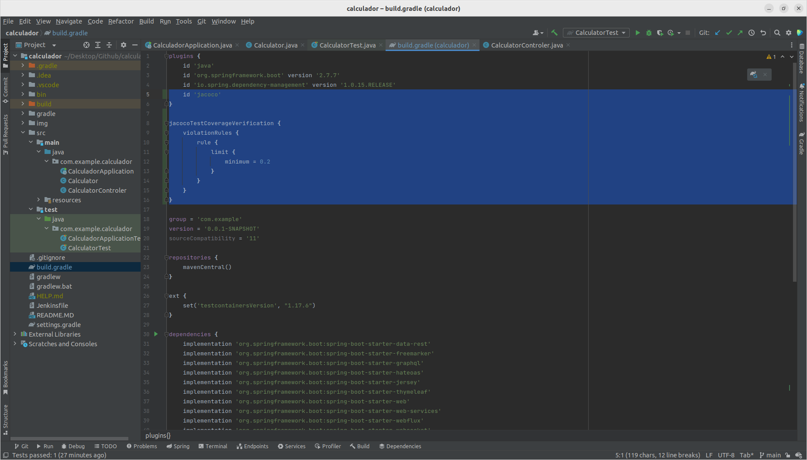
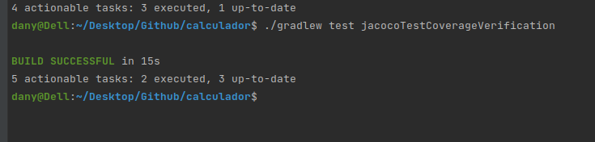
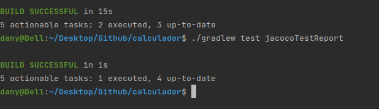
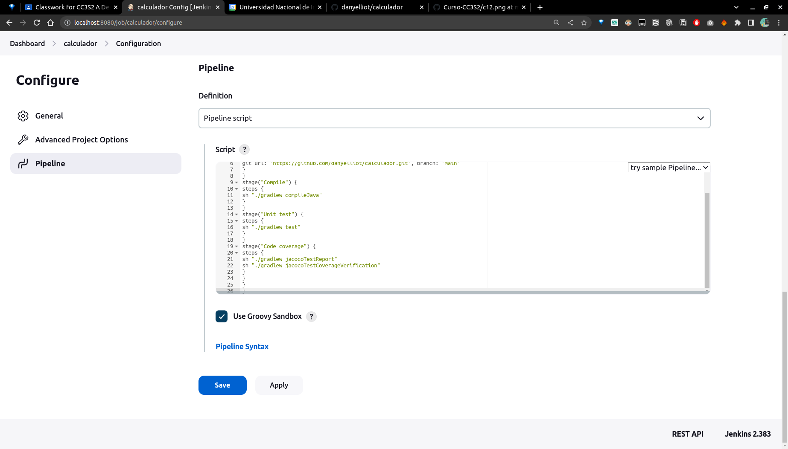
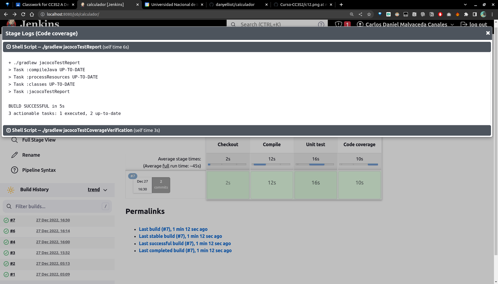
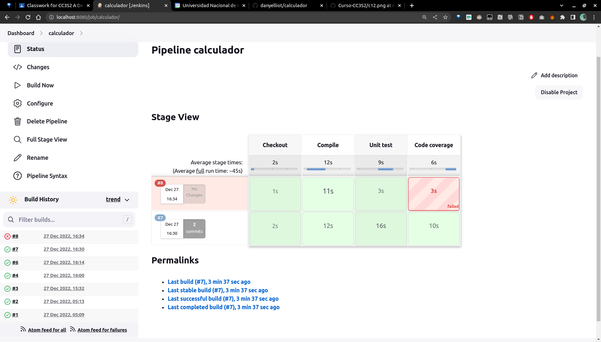
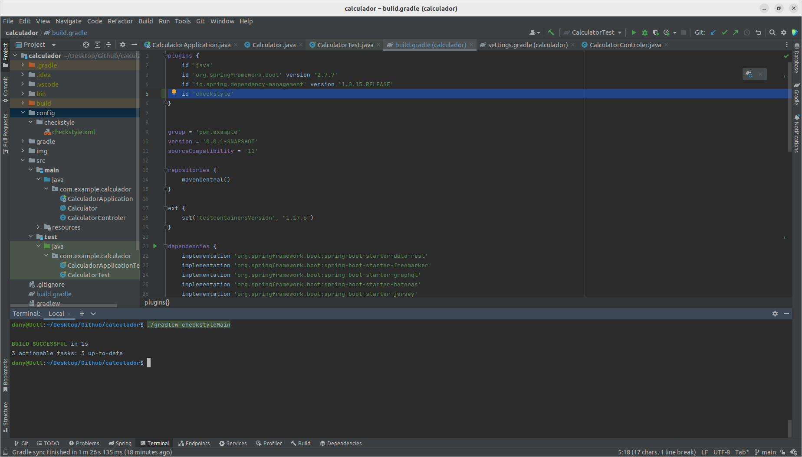
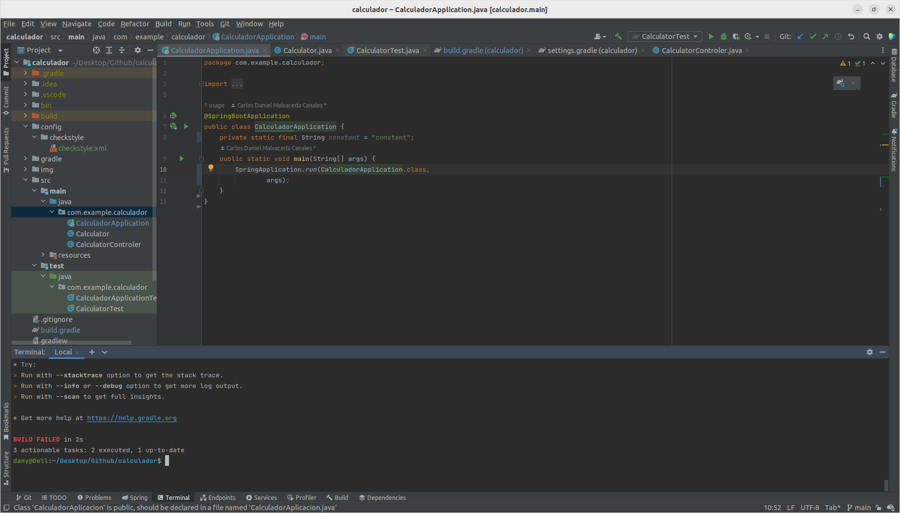

# Actividad 22

Toda la actividad se encuentra en el repositorio [calculador](https://github.com/danyelliot/calculador)


## Agregar JaCoCo a Gradle



### Ejecución

```
$ ./gradlew test jacocoTestCoverageVerification
```



```
$ ./gradlew test jacocoTestReport
```



## Agregando una etapa de cobertura de código





## Publicación del informe de cobertura de código



## Análisis de código estático

1. Agregamos la configuración de Checkstyle
2. Agregamos la etapa Checkstyle
3. Opcionalmente, publicamos el informe Checkstyle en Jenkins

## Agregamos la configuración de Checkstyle

```
<?xml version="1.0"?>
<!DOCTYPE module PUBLIC
    "-//Puppy Crawl//DTD Check Configuration 1.2//EN"
    "http://www.puppycrawl.com/dtds/configuration_1_2.dtd">
<module name="Checker">
   <module name="TreeWalker">
     <module name="ConstantName"/>
    </module>
</module>
```

## Información

```
plugins {
...
id 'checkstyle'
}
```

```
$ ./gradlew checkstyleMain
```



Agregando 

```
@SpringBootApplication
public class CalculatorApplication {
private static final String constant = "constant";
public static void main(String[] args) {
SpringApplication.run(CalculatorApplication.class,
args);
}
}
```




## Agregando una etapa de análisis de código estático

```
stage("Static code analysis") {

steps {
sh "./gradlew checkstyleMain"
}
}
```
